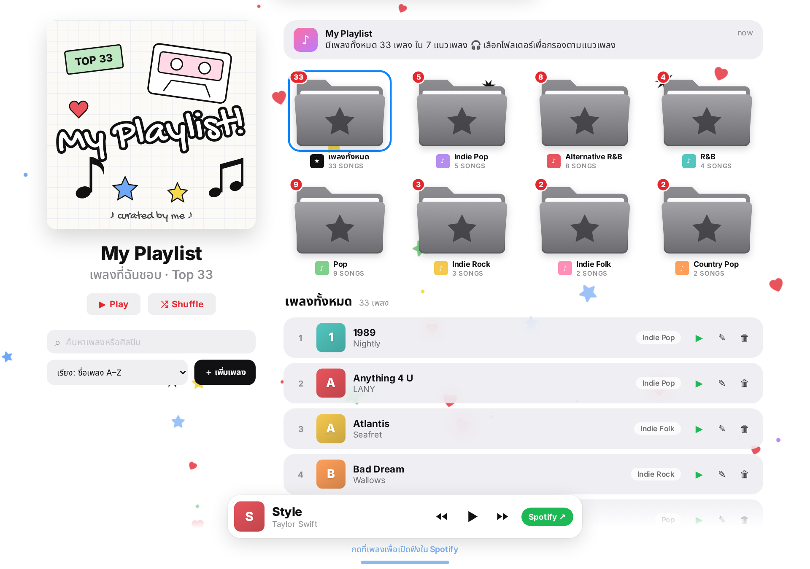
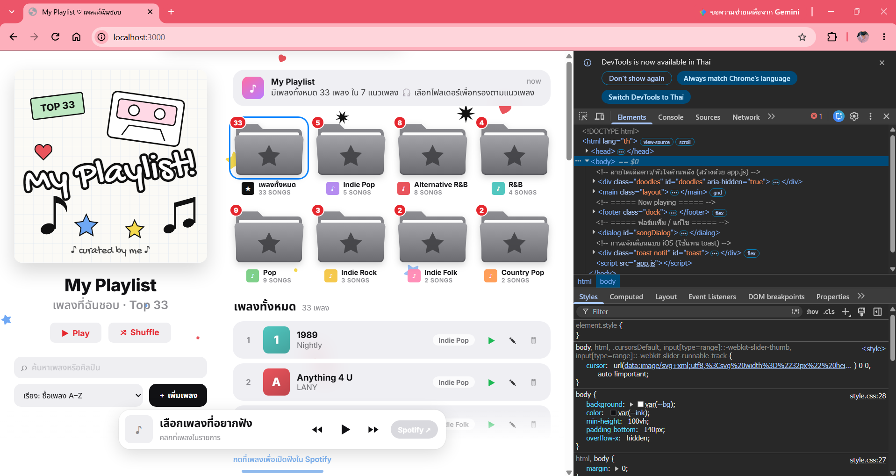
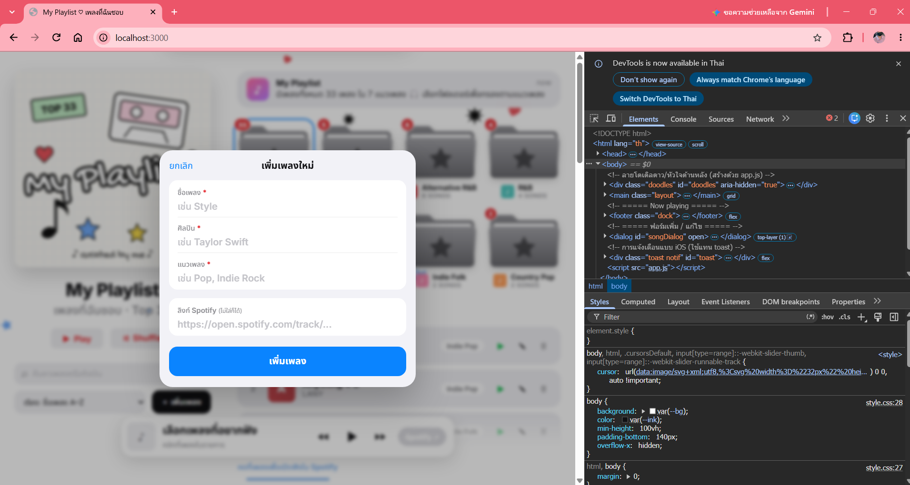
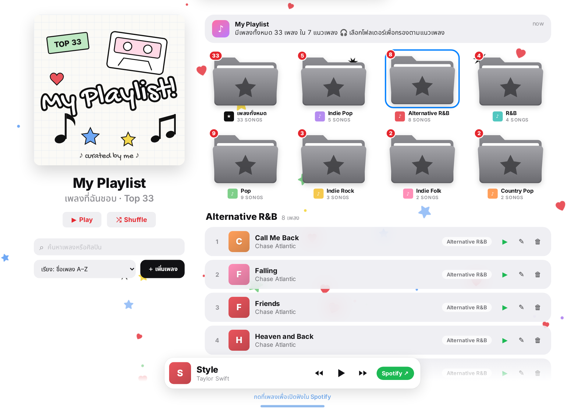
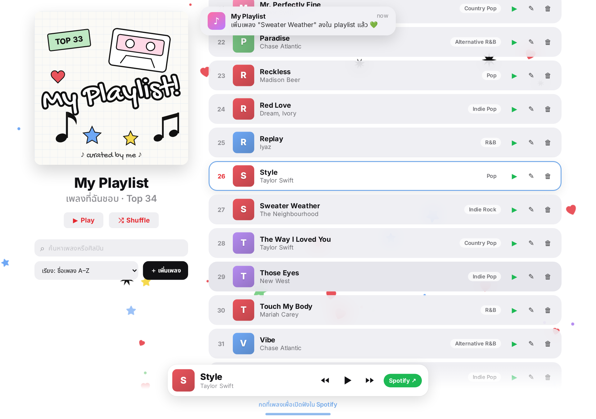
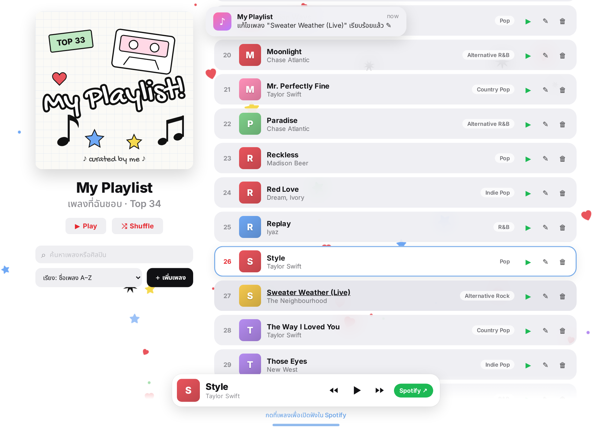

# 🎵 My Playlist — เว็บแอปรวมเพลงที่ฉันชอบ

Mini Project: เว็บไซต์แบบ full-stack ที่มี **REST API ด้วย Node.js + Express.js** และหน้าเว็บฝั่งไคลเอนต์ที่เขียนด้วย **HTML, CSS, JavaScript** (ไม่ใช้ framework)

แอปนี้ใช้เก็บรายการ **เพลงและแนวเพลงที่ฉันชอบฟัง** (ข้อมูลเริ่มต้น 33 เพลง 7 แนวเพลง) 

- ดูรายการเพลงทั้งหมด (เรียงตามตัวอักษร A–Z เป็นค่าเริ่มต้น) กรองตามแนวเพลง / ค้นหาชื่อเพลงหรือศิลปิน / เปลี่ยนการเรียงลำดับได้
- เพิ่มเพลงใหม่ (มีการตรวจสอบข้อมูลก่อนบันทึก)
- แก้ไขเพลง
- ลบเพลง
- กดที่เพลงเพื่อเปิดฟังใน **Spotify** (แท็บใหม่) ถ้าไม่ได้ใส่ลิงก์เพลงไว้ จะเปิดหน้าค้นหาเพลงนั้นใน Spotify ให้อัตโนมัติ

ทุกอย่างทำงานผ่าน `fetch()` โดยไม่ต้องโหลดหน้าใหม่ และเรียกเฉพาะ API ของตัวเองเท่านั้น



---

## 📁 โครงสร้างโปรเจกต์
server/server.js สร้าง Express app โดยใช้ express.json() อ่าน body แบบ JSON และ express.static() เสิร์ฟไฟล์ในโฟลเดอร์ public ทำให้เปิดหน้าเว็บและเรียก API ได้จาก http://localhost:3000 ที่เดียว
server/data/songs.json เซิร์ฟเวอร์อ่านไฟล์นี้ตอนเริ่มทำงาน และเขียนทับทุกครั้งที่มีการเพิ่ม แก้ไข หรือลบ ข้อมูลจึงไม่หายเมื่อปิดเซิร์ฟเวอร์
public/app.js มีฟังก์ชันหลักคือ loadSongs(), loadGenres(), renderSongs() และตัวจัดการปุ่มต่าง ๆ
package.json กำหนดคำสั่ง npm start (node) และ npm run dev (nodemon)

```

## ⚙️ วิธีติดตั้ง

ต้องมี [Node.js](https://nodejs.org/) (เวอร์ชัน 18 ขึ้นไป)

```bash
git clone <URL ของ repository นี้>
cd music-app
npm install
```

## ▶️ วิธีรัน

```bash
npm run dev     # รันแบบ development (nodemon รีสตาร์ตอัตโนมัติเมื่อแก้โค้ด)
# หรือ
npm start       # รันแบบปกติ
```

จากนั้นเปิดเบราว์เซอร์ไปที่ **http://localhost:3000**

> ⚠ ต้องเปิดผ่าน `http://localhost:3000` เท่านั้น ถ้าดับเบิลคลิกเปิดไฟล์ `public/index.html` ตรง ๆ หน้าเว็บจะดึงรายชื่อเพลงจาก API ไม่ได้ และต้องเปิดหน้าต่าง command prompt ที่รัน `npm run dev` ค้างไว้ตลอดที่ใช้งาน

---

## 🎶 รายชื่อเพลงในแอป (ข้อมูลเริ่มต้น 33 เพลง)

เก็บอยู่ในไฟล์ `server/data/songs.json`

| # | ชื่อเพลง | ศิลปิน | แนวเพลง |
|---|---|---|---|
| 1 | Anything 4 U | LANY | Indie Pop |
| 2 | 1989 | Nightly | Indie Pop |
| 3 | Friends | Chase Atlantic | Alternative R&B |
| 4 | Call Me Back | Chase Atlantic | Alternative R&B |
| 5 | Vibe | Chase Atlantic | Alternative R&B |
| 6 | Into It | Chase Atlantic | Alternative R&B |
| 7 | Paradise | Chase Atlantic | Alternative R&B |
| 8 | Moonlight | Chase Atlantic | Alternative R&B |
| 9 | Falling | Chase Atlantic | Alternative R&B |
| 10 | Heaven and Back | Chase Atlantic | Alternative R&B |
| 11 | Double Take | dhruv | R&B |
| 12 | Million Ways | HRVY | Pop |
| 13 | Break My Heart | Dua Lipa | Pop |
| 14 | Bad Dream | Wallows | Indie Rock |
| 15 | Domino | Jessie J | Pop |
| 16 | Style | Taylor Swift | Pop |
| 17 | exile | Taylor Swift | Indie Folk |
| 18 | The Way I Loved You | Taylor Swift | Country Pop |
| 19 | Daylight | Taylor Swift | Pop |
| 20 | Mr. Perfectly Fine | Taylor Swift | Country Pop |
| 21 | Don't Blame Me | Taylor Swift | Pop |
| 22 | Getaway Car | Taylor Swift | Pop |
| 23 | Red Love | Dream, Ivory | Indie Pop |
| 24 | Welcome and Goodbye | Dream, Ivory | Indie Pop |
| 25 | Reckless | Madison Beer | Pop |
| 26 | End of Beginning | Djo | Indie Rock |
| 27 | Replay | Iyaz | R&B |
| 28 | Will You Be My Valentine | Valen | Pop |
| 29 | Those Eyes | New West | Indie Pop |
| 30 | Atlantis | Seafret | Indie Folk |
| 31 | I Wanna Be Yours | Arctic Monkeys | Indie Rock |
| 32 | Touch My Body | Mariah Carey | R&B |
| 33 | You Da One | Rihanna | R&B |

---

## 🔌 REST API Endpoints

Resource: **`songs`** — ข้อมูลเพลงแต่ละรายการมีโครงสร้างดังนี้

| ฟิลด์ | ชนิด | บังคับ | คำอธิบาย |
|---|---|---|---|
| `id` | number | (สร้างอัตโนมัติ) | รหัสเพลง |
| `title` | string | ✅ | ชื่อเพลง |
| `artist` | string | ✅ | ศิลปิน |
| `genre` | string | ✅ | แนวเพลง เช่น Pop, Indie Rock, Alternative R&B |
| `spotifyUrl` | string \| null | – | ลิงก์เพลงใน Spotify (ต้องขึ้นต้นด้วย `https://open.spotify.com/`) |

### สรุป endpoint ทั้งหมด

| Method | Endpoint | คำอธิบาย | Status code |
|---|---|---|---|
| `GET` | `/api/songs` | ดึงเพลงทั้งหมด (รองรับ query string ด้านล่าง) | 200 |
| `GET` | `/api/songs/:id` | ดึงเพลงเดียวตาม id | 200, **404** ถ้าไม่พบ |
| `POST` | `/api/songs` | เพิ่มเพลงใหม่ | **201** สำเร็จ, **400** ข้อมูลไม่ครบ |
| `PATCH` | `/api/songs/:id` | แก้ไขบางฟิลด์ของเพลง | 200, 400, **404** ถ้าไม่พบ |
| `DELETE` | `/api/songs/:id` | ลบเพลง | **204** สำเร็จ, 404 ถ้าไม่พบ |
| `GET` | `/api/genres` | (เสริม) รายชื่อแนวเพลงพร้อมจำนวนเพลง | 200 |

### Query string ของ `GET /api/songs`

| พารามิเตอร์ | ตัวอย่าง | ผลลัพธ์ |
|---|---|---|
| `genre` | `?genre=Pop` | เฉพาะแนวเพลงนั้น (ไม่สนตัวพิมพ์เล็ก/ใหญ่) |
| `artist` | `?artist=taylor` | ศิลปินที่มีคำนี้ในชื่อ |
| `q` | `?q=love` | ค้นหาในชื่อเพลงหรือชื่อศิลปิน |
| `sort` | `?sort=artist` | เรียงตาม `title` หรือ `artist` |

ใช้ร่วมกันได้ เช่น `GET /api/songs?genre=Pop&q=taylor&sort=title`

### ตัวอย่าง request / response

```http
POST /api/songs
Content-Type: application/json

{ "title": "Sweater Weather", "artist": "The Neighbourhood", "genre": "Indie Rock" }
```
```http
HTTP/1.1 201 Created
{ "id": 34, "title": "Sweater Weather", "artist": "The Neighbourhood", "genre": "Indie Rock", "spotifyUrl": null }
```

ถ้าข้อมูลไม่ครบ:
```http
HTTP/1.1 400 Bad Request
{ "error": "ข้อมูลไม่ครบหรือไม่ถูกต้อง", "details": ["artist (ศิลปิน) ห้ามว่าง", "genre (แนวเพลง) ห้ามว่าง"] }
```

---

## 🐞 หลักฐานการดีบัก

**ภาพที่ 1 —** <!-- TODO: ใส่คำอธิบาย เช่น ตั้ง breakpoint ใน VS Code ที่ route POST /api/songs -->



**ภาพที่ 2 —** <!-- TODO: ใส่คำอธิบาย เช่น แท็บ Network ใน DevTools แสดง request/response ของ fetch() -->



---

## 📸 ภาพการทำงานเพิ่มเติม

| กรองตามแนวเพลง | เพิ่มเพลงใหม่ | แก้ไขเพลง |
|---|---|---|
|  |  |  |

รายงานฉบับเต็มพร้อมภาพทุกขั้นตอนอยู่ที่ [`docs/report.pdf`](docs/report.pdf)
